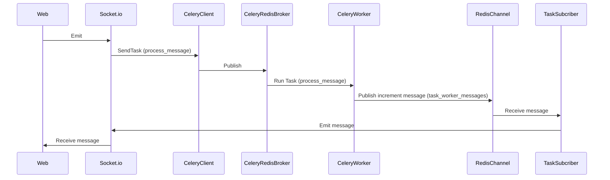

# Start the servers

```sh
docker-compose build
docker-compose up
```

# virtual env setup

```sh
python3 -m venv .venv
source ./.venv/bin/activate

pip3 install -r requirements.txt
```

# Communicate through socket.io

```sh
python3
import socketio
sio = socketio.SimpleClient()
sio.connect('<http://localhost:3000>')
sio.emit('chat message', {"test": "TEST"})
```


